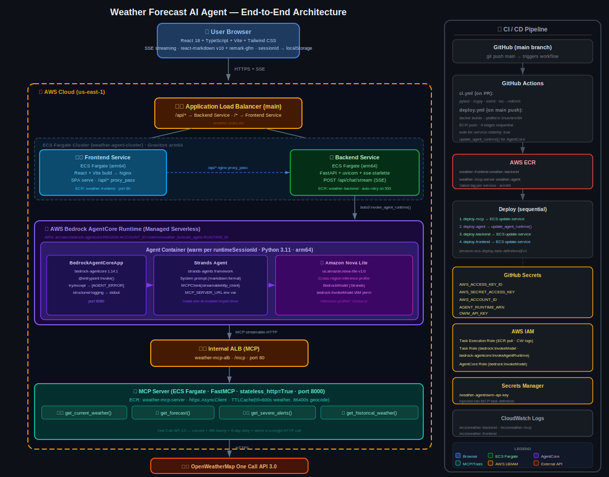

# Weather Forecast AI Agent

A full-stack AI-powered weather assistant. Users ask natural language questions ("Will it rain in Tokyo tomorrow?") and receive rich, real-time weather responses streamed directly in a chat UI.



---

## Architecture Overview

```
User Browser (React)
       │  HTTPS + SSE
       ▼
AWS Application Load Balancer
  /* → Frontend Service
  /api/* → Backend Service
       │
       ▼
┌─────────────────────────────────────┐
│  ECS Fargate Cluster  (arm64)       │
│  ┌──────────────┐  ┌─────────────┐ │
│  │   Frontend   │  │   Backend   │ │
│  │  React+Nginx │  │   FastAPI   │ │
│  └──────────────┘  └──────┬──────┘ │
└─────────────────────────────┼───────┘
                              │ boto3 invoke_agent_runtime
                              ▼
              AWS Bedrock AgentCore Runtime
              ┌────────────────────────────────────────────┐
              │  Agent Container (warm per session)        │
              │  BedrockAgentCoreApp → Strands Agent       │
              │  Model: Amazon Nova Lite                   │
              │  MCPClient (streamable-HTTP)               │
              └──────────────────┬─────────────────────────┘
                                 │ MCP over HTTP
                                 ▼
                    Internal ALB → MCP Server (ECS)
                    FastMCP · stateless_http=True
                    ┌──────────────────────────────────────┐
                    │  get_current_weather()               │
                    │  get_forecast()                      │
                    │  get_severe_alerts()                 │
                    │  get_historical_weather()            │
                    └────────────────┬─────────────────────┘
                                     │ HTTPS
                                     ▼
                         OpenWeatherMap One Call API 3.0
```

### Request Flow

1. **User** types a question in the React chat UI
2. **Browser** sends `POST /api/chat/stream` to the ALB
3. **ALB** routes `/api/*` to the FastAPI backend (ECS Fargate)
4. **Backend** calls `bedrock-agentcore:InvokeAgentRuntime` via boto3
5. **AgentCore** routes to a warm container running the Strands Agent
6. **Strands Agent** reasons with Amazon Nova Lite and calls MCP tools as needed
7. **MCP Server** fetches live data from OpenWeatherMap One Call API 3.0
8. Response streams back through the chain as **SSE chunks** to the browser
9. **React** renders the markdown-formatted weather response in real time

---

## Tech Stack

### Frontend
| Library | Version | Purpose |
|---|---|---|
| React | 18 | UI framework |
| TypeScript | 5 | Type safety |
| Vite | 5 | Build tool |
| Tailwind CSS | 3 | Styling (dark theme) |
| react-markdown | 10 | Render markdown responses |
| remark-gfm | 4 | GFM tables, blockquotes |
| Nginx | latest | SPA host + `/api/*` proxy |

### Backend
| Library | Version | Purpose |
|---|---|---|
| FastAPI | ≥0.115 | REST API + SSE streaming |
| uvicorn | ≥0.30 | ASGI server |
| sse-starlette | ≥2.1 | Server-Sent Events |
| boto3 | ≥1.35 | AWS SDK (AgentCore invoke) |

### Agent (AgentCore Runtime)
| Library | Version | Purpose |
|---|---|---|
| bedrock-agentcore | 1.14.1 | Managed runtime framework |
| strands-agents | ≥1.0 | Agent orchestration |
| mcp | ≥1.10 | MCP client protocol |
| boto3 | ≥1.35 | Bedrock model calls |

**Model:** `us.amazon.nova-lite-v1:0` (cross-region inference profile)

### MCP Server
| Library | Version | Purpose |
|---|---|---|
| FastMCP | ≥2.5 | MCP server framework |
| httpx | ≥0.27 | Async HTTP to OpenWeatherMap |
| cachetools | ≥5.3 | TTLCache (10 min weather, 24 h geocode) |

### AWS Services
| Service | Role |
|---|---|
| Bedrock AgentCore Runtime | Managed serverless container for the agent |
| Amazon Nova Lite | LLM for reasoning and tool-call decisions |
| ECS Fargate (arm64) | Runs frontend, backend, MCP server |
| Application Load Balancer × 2 | Public ALB (path routing) + internal ALB (MCP) |
| ECR | Container image registry (4 repos) |
| Secrets Manager | Stores `OWM_API_KEY` |
| IAM | Task execution role, task role, AgentCore runtime role |
| CloudWatch Logs | `/ecs/weather-backend`, `/ecs/weather-mcp`, `/ecs/weather-frontend` |

---

## Monorepo Structure

```
weather-forecast-ai-agent/
├── .github/workflows/
│   ├── ci.yml              # lint + test on every PR
│   └── deploy.yml          # ECR build+push + ECS/AgentCore deploy on main
├── infrastructure/
│   ├── setup_ecr.sh                    # create 4 ECR repos
│   ├── setup_iam.sh                    # create IAM roles
│   ├── register_task_definitions.sh    # register ECS task defs + create cluster
│   ├── create_agentcore_runtime.py     # create/update AgentCore Runtime
│   ├── task-def-backend.json
│   ├── task-def-frontend.json
│   └── task-def-mcp.json
├── mcp-server/
│   └── src/weather_mcp/
│       ├── main.py             # FastMCP app
│       ├── clients/owm.py      # OpenWeatherMap httpx client + TTLCache
│       └── tools/              # weather, location, alerts, history
├── agent/
│   └── src/weather_agent/
│       ├── main.py             # BedrockAgentCoreApp entrypoint
│       ├── agent.py            # Strands Agent + MCPClient setup
│       └── prompts.py          # System prompt (structured markdown output)
├── backend/
│   └── src/weather_api/
│       ├── main.py             # FastAPI app
│       ├── routers/chat.py     # POST /api/chat/stream (SSE)
│       └── services/agentcore.py  # invoke_agent_runtime + auto-retry
├── frontend/
│   └── src/
│       ├── components/         # ChatInterface, MessageBubble, MessageInput
│       ├── hooks/useChat.ts    # SSE streaming hook
│       └── services/api.ts
├── architecture.svg            # End-to-end architecture diagram
├── docker-compose.yml          # Local development
└── .env.example                # Environment variable template
```

---

## Local Development

### Prerequisites
- Docker + Docker Compose
- AWS credentials with `bedrock:InvokeModel` permission
- OpenWeatherMap API key (free tier at openweathermap.org)

### Setup

```bash
git clone https://github.com/sabmaverick1305/weather-forecaster-agent.git
cd weather-forecaster-agent

cp .env.example .env
# Edit .env — fill in OWM_API_KEY and AWS credentials
```

### Run all services

```bash
docker compose up --build
```

| Service | URL |
|---|---|
| Frontend | http://localhost:3000 |
| Backend API | http://localhost:8001 |
| MCP Server | http://localhost:8000/mcp |
| Agent (direct) | http://localhost:8080/invocations |

> The backend uses `LOCAL_AGENT_URL=http://agent:8080/invocations` in Docker Compose, bypassing AgentCore and calling the agent container directly. Set `AGENT_RUNTIME_ARN` and remove `LOCAL_AGENT_URL` to use AgentCore.

---

## Environment Variables

| Variable | Required | Description |
|---|---|---|
| `OWM_API_KEY` | Yes | OpenWeatherMap API key |
| `AWS_REGION` | Yes | AWS region (e.g. `us-east-1`) |
| `AWS_ACCESS_KEY_ID` | Local dev | AWS access key (use IAM role on ECS) |
| `AWS_SECRET_ACCESS_KEY` | Local dev | AWS secret key |
| `AGENT_RUNTIME_ARN` | Production | Bedrock AgentCore Runtime ARN |
| `MCP_SERVER_URL` | Agent container | URL of the MCP server (set by AgentCore env) |
| `LOCAL_AGENT_URL` | Local dev | Bypasses AgentCore — calls agent container directly |
| `BEDROCK_MODEL_ID` | Optional | Default: `us.amazon.nova-lite-v1:0` |

---

## AWS Deployment

### 1. Bootstrap infrastructure (run once)

```bash
export AWS_REGION=us-east-1

# Create ECR repositories
bash infrastructure/setup_ecr.sh

# Create IAM roles
bash infrastructure/setup_iam.sh

# Store OWM API key in Secrets Manager
aws secretsmanager create-secret \
  --name /weather-agent/owm-api-key \
  --secret-string '{"OWM_API_KEY":"<your-key>"}'

# Register ECS task definitions + create cluster
export AWS_ACCOUNT_ID=$(aws sts get-caller-identity --query Account --output text)
export AGENT_RUNTIME_ARN=<your-agentcore-arn>   # set after step 2
bash infrastructure/register_task_definitions.sh
```

### 2. Create AgentCore Runtime

```bash
# Build and push the agent image first
IMAGE="$AWS_ACCOUNT_ID.dkr.ecr.$AWS_REGION.amazonaws.com/weather-agent:latest"
docker buildx build --platform linux/arm64 -t "$IMAGE" --push ./agent

# Create the runtime (saves ARN to stdout)
export MCP_SERVER_URL=http://<your-mcp-alb-dns>/mcp
python infrastructure/create_agentcore_runtime.py --image "$IMAGE"
```

### 3. CI/CD via GitHub Actions

Add these secrets to your GitHub repository (**Settings → Secrets → Actions**):

| Secret | Value |
|---|---|
| `AWS_ACCESS_KEY_ID` | IAM user access key |
| `AWS_SECRET_ACCESS_KEY` | IAM user secret key |
| `AWS_ACCOUNT_ID` | 12-digit AWS account ID |
| `AGENT_RUNTIME_ARN` | AgentCore Runtime ARN from step 2 |
| `OWM_API_KEY` | OpenWeatherMap API key |

Every push to `main` triggers the deploy pipeline:

```
deploy-mcp → deploy-agent → deploy-backend → deploy-frontend
```

Each stage builds an `arm64` image, pushes to ECR, and updates the ECS service (waits for stability before proceeding).

---

## CI Pipeline

Every pull request runs four parallel jobs:

```
lint-test-mcp      ruff check + pytest
lint-test-agent    ruff check + pytest
lint-test-backend  ruff check + pytest
typecheck-frontend tsc --noEmit + vite build
```

---

## Key Design Decisions

**Warm container sessions** — AgentCore reuses containers per `runtimeSessionId`. The backend normalises session IDs and auto-retries with a fresh UUID on any 500 error, ensuring stale containers don't block users.

**Stateless MCP server** — `stateless_http=True` in FastMCP allows horizontal scaling without sticky sessions.

**Single OpenWeatherMap call** — One Call API 3.0 returns current conditions, 48 h hourly forecast, 8-day daily forecast, and severe alerts in a single HTTP request, minimising API usage.

**Structured markdown output** — The agent system prompt instructs Nova Lite to format all responses as markdown with emoji, tables, and blockquotes so the frontend renders rich weather cards without any post-processing.

**SSE streaming** — Responses stream token-by-token from AgentCore → FastAPI → browser using Server-Sent Events, giving users immediate feedback for longer responses.
